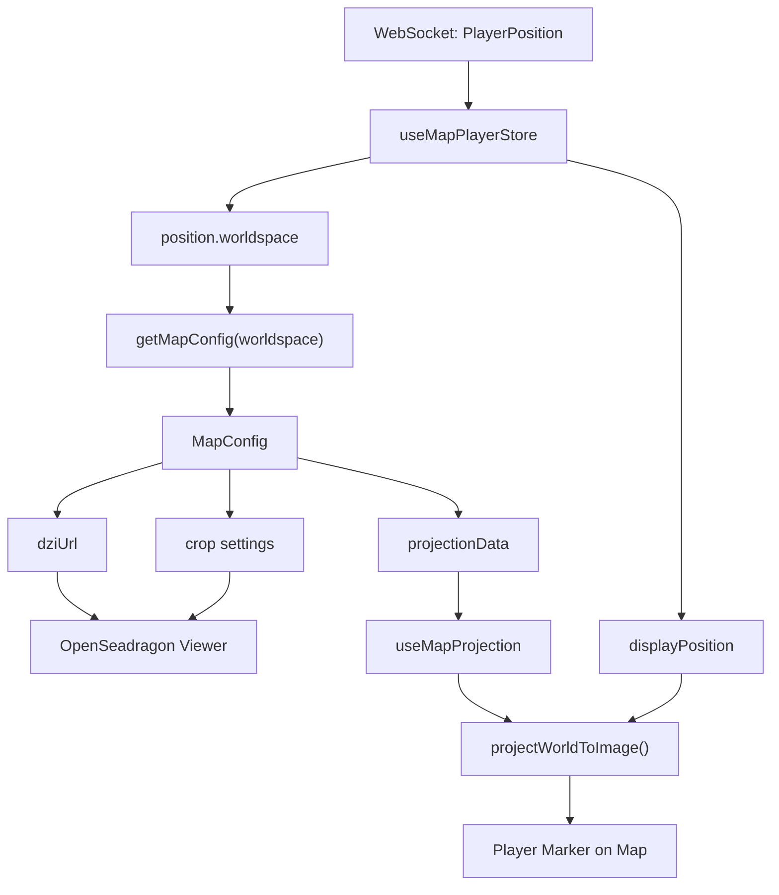
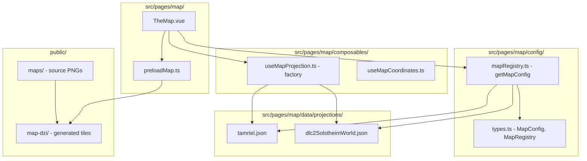

# План: Поддержка нескольких карт (Multi-Map)

## Статус выполнения

| Шаг | Описание | Статус |
|---|---|---|
| 1.1 | Создать `config/types.ts` и `config/mapRegistry.ts` | ✅ Выполнено |
| 1.2 | Переименовать `tamrielProjection.json` → `projections/tamriel.json` | ✅ Выполнено |
| 1.3 | Рефакторинг `useMapProjection.ts` (фабрика) | ✅ Выполнено |
| 1.4 | Рефакторинг `preloadMap.ts` (параметризованный `dziUrl`) | ✅ Выполнено |
| 1.5 | Рефакторинг `TheMap.vue` (динамический выбор карты) | ✅ Выполнено |
| 1.6 | Обновить `index.ts` баррель | ✅ Выполнено |
| 1.7 | Обновить CI/CD `build-map.yml` | ✅ Выполнено |
| 1.8 | Переместить `skyrim.png` → `maps/tamriel.png` + переименовать DZI | ✅ Выполнено |
| 2.1 | Проверить скрипт `extract-fwmf-projection.py` | ✅ Выполнено |
| 2.2 | Создать документацию по извлечению проекций | ✅ Выполнено |
| 2.3 | Обновить план в `.md` файле | ✅ Выполнено |

## Обзор

Сейчас проект рендерит единственную карту (`public/skyrim.png` → `public/map-dzi/skyrim.dzi`) через OpenSeadragon в компоненте [`TheMap.vue`](src/pages/map/TheMap.vue). Координатная проекция загружается статически из [`tamrielProjection.json`](src/pages/map/data/tamrielProjection.json).

**Цель:** добавить возможность рендерить несколько карт, выбирая активную по полю `worldspace` из [`useMapPlayerStore`](src/stores/map/useMapPlayerStore.ts). Каждая карта должна иметь свой набор DZI-тайлов и свой файл проекции.

---

## Архитектурные решения

### Идентификатор карты — `worldspace`

Ключом для выбора карты служит поле `worldspace` из `PlayerPosition` (см. [`types.ts`](src/stores/map/types.ts:119)). Примеры значений:

| worldspace | Карта |
|---|---|
| `"Tamriel"` | Основная карта Скайрима (текущая, по умолчанию) |
| `"DLC2SolstheimWorld"` | Солстейм (DLC Dragonborn) |
| `null` / неизвестный | fallback → Tamriel (карта по умолчанию) |

### Реестр карт (`mapRegistry`)

Централизованный конфиг, сопоставляющий `worldspace` → `MapConfig`. Каждая запись содержит:

```ts
interface MapConfig {
  worldspace: string;               // ключ (напр. "Tamriel")
  dziUrl: string;                   // URL до .dzi файла (напр. "/map-dzi/tamriel.dzi")
  projectionData: ProjectionData;   // данные проекции (из JSON)
  imageCorrection?: ImageCorrectionMatrix; // аффинная коррекция изображения
  cropX: number;                    // обрезка краёв (лево/право)
  cropYTop: number;                 // обрезка сверху
  cropYBottom: number;              // обрезка снизу
  referencePoints?: ReferencePoint[]; // калибровочные точки (для useMapCoordinates)
}
```

### Структура каталогов

```
public/
  maps/                              # Исходные PNG-файлы карт
    tamriel.png                      # (переименован из skyrim.png)
    dlc2SolstheimWorld.png           # (будущая карта)
  map-dzi/                           # Генерируемые DZI-тайлы
    tamriel.dzi
    tamriel_files/
    dlc2SolstheimWorld.dzi
    dlc2SolstheimWorld_files/

src/pages/map/
  data/
    projections/                     # JSON-файлы проекций
      tamriel.json                   # (переименован из tamrielProjection.json)
      dlc2SolstheimWorld.json        # (будущая проекция)
  config/
    mapRegistry.ts                   # Реестр карт
    types.ts                         # Типы MapConfig, MapRegistry
```

---

## Шаг 1: Рефакторинг для поддержки нескольких карт

### 1.1. Создать типы конфигурации карт

**Файл:** `src/pages/map/config/types.ts`

- Определить `MapConfig` интерфейс (см. выше)
- Определить `MapRegistry` тип: `Record<string, MapConfig>`
- Перенести `ImageCorrectionMatrix` из [`useMapProjection.ts`](src/pages/map/composables/useMapProjection.ts:44)

### 1.2. Создать реестр карт

**Файл:** `src/pages/map/config/mapRegistry.ts`

- Импортировать `tamriel.json` (переименованный `tamrielProjection.json`)
- Создать запись для Tamriel со всеми текущими хардкод-значениями из [`TheMap.vue`](src/pages/map/TheMap.vue:89-102) (`MAP_CROP_X`, `MAP_CROP_Y_TOP`, `MAP_CROP_Y_BOTTOM`, `IMAGE_CORRECTION`)
- Экспортировать `mapRegistry: MapRegistry`
- Экспортировать хелпер: `getMapConfig(worldspace: string | null): MapConfig` — возвращает конфиг для worldspace или fallback на Tamriel
- Экспортировать `DEFAULT_MAP_WORLDSPACE = 'Tamriel'`

### 1.3. Переименовать файлы

- `src/pages/map/data/tamrielProjection.json` → `src/pages/map/data/projections/tamriel.json`
- Обновить все импорты в [`useMapProjection.ts`](src/pages/map/composables/useMapProjection.ts:2)

### 1.4. Рефакторинг `useMapProjection.ts`

**Файл:** [`src/pages/map/composables/useMapProjection.ts`](src/pages/map/composables/useMapProjection.ts)

Текущая проблема: проекция жёстко привязана к статическому импорту `tamrielProjection` и статической `IMAGE_CORRECTION`.

**Изменения:**
- Превратить `useMapProjection()` в фабрику, принимающую `MapConfig`:
  ```ts
  export function useMapProjection(config: MapConfig): UseMapProjection
  ```
- Убрать статический импорт `tamrielProjection`
- Убрать глобальные `FWMF_MAP_*` константы (или сделать их вычисляемыми из конфига)
- `IMAGE_CORRECTION` брать из `config.imageCorrection`
- Все вычисления (`buildTriangleGrid`, `projectWorldToImage`) должны использовать данные из переданного конфига
- Экспортировать `createMapProjection(projectionData: ProjectionData, imageCorrection?: ImageCorrectionMatrix)` — чистая функция для проекции

### 1.5. Рефакторинг `preloadMap.ts`

**Файл:** [`src/pages/map/preloadMap.ts`](src/pages/map/preloadMap.ts)

Текущая проблема: `MAP_DZI_URL` жёстко задан как `/map-dzi/skyrim.dzi`.

**Изменения:**
- Удалить глобальную константу `MAP_DZI_URL`
- `prefetchMapTiles()` должен принимать `dziUrl: string` параметром:
  ```ts
  export function prefetchMapTiles(dziUrl: string): Promise<void>
  ```
- `loadDziInfo(dziUrl)` уже принимает URL — ОК
- `mapTileBlobUrls` остаётся общим кешем для всех карт (ключ — полный URL тайла)
- Добавить `prefetchAllMaps()` — опционально, для предзагрузки всех карт сразу
- Экспортировать `mapTileBlobUrls`, `mapTilesPrefetchActive`, `mapTilesPrefetchProgress` как и раньше

### 1.6. Рефакторинг `TheMap.vue`

**Файл:** [`src/pages/map/TheMap.vue`](src/pages/map/TheMap.vue)

**Изменения:**
- Получать `worldspace` из `useMapPlayerStore`:
  ```ts
  const { displayPosition, position } = storeToRefs(playerStore);
  const currentWorldspace = computed(() => position.value?.worldspace ?? null);
  ```
- Получать `MapConfig` через `getMapConfig(currentWorldspace.value)`
- `detectTileSource()` использовать `config.dziUrl` вместо `MAP_DZI_URL`
- `MAP_CROP_X/Y_TOP/Y_BOTTOM` брать из `config.cropX/cropYTop/cropYBottom`
- `useMapProjection()` вызывать с параметром `config`
- `attachSharedTileCache()` — без изменений (работает с URL)
- `prefetchMapTiles()` вызывать с `config.dziUrl`
- При смене `worldspace` — пересоздавать OSD viewer (destroy + setup)
- Watch на `currentWorldspace` для переключения карты

### 1.7. Обновить `index.ts` баррель

**Файл:** [`src/pages/map/index.ts`](src/pages/map/index.ts)

- Убрать экспорт `MAP_DZI_URL`, `FWMF_MAP_*` констант
- Добавить экспорт `mapRegistry`, `getMapConfig`, `DEFAULT_MAP_WORLDSPACE`
- Добавить экспорт типов `MapConfig`, `MapRegistry`

### 1.8. Обновить CI/CD `build-map.yml`

**Файл:** [`.github/workflows/build-map.yml`](.github/workflows/build-map.yml)

**Изменения:**
- Вместо скачивания одного `skyrim.png`, скачивать все PNG из релиза `map-source`:
  ```bash
  gh release download "${{ inputs.source_tag }}" \
    --pattern '*.png' \
    --dir map-build/maps/
  ```
- Или скачивать весь архив `maps/` директории
- Генерировать DZI для каждого PNG в `map-build/maps/`:
  ```bash
  for png in map-build/maps/*.png; do
    name=$(basename "$png" .png)
    vips dzsave "$png" "map-build/map-dzi/$name" \
      --layout dz \
      --tile-size 512 \
      --overlap 1 \
      --suffix '.webp[Q=80]'
  done
  ```
- Упаковать всю `map-dzi/` директорию в `map-dzi.tar.gz`
- Структура релиза `map-assets` остаётся совместимой: архив содержит `map-dzi/` с поддиректориями для каждой карты

### 1.9. Обновить `public/` структуру

- Создать `public/maps/` директорию
- Переместить `public/skyrim.png` → `public/maps/tamriel.png`
- `public/map-dzi/` остаётся на месте, но теперь содержит `tamriel.dzi` + `tamriel_files/` (переименовать `skyrim.dzi` → `tamriel.dzi`)

---

## Шаг 2: Система проекций для каждой карты

### 2.1. Проверить скрипт `extract-fwmf-projection.py`

**Файл:** [`scripts/extract-fwmf-projection.py`](scripts/extract-fwmf-projection.py)

**Проверки:**
- Корректность работы с BTR-файлами через `pyffi`
- Правильность извлечения вершин и UV-координат
- Корректность трансформации вершин (`transform_vertex`)
- Соответствие выходного формата ожидаемому в `useMapProjection.ts`

**Возможные проблемы:**
- `pyffi` может быть устаревшим для новых версий Python
- BTR-файлы разных worldspace'ов могут иметь разную структуру
- `--shape` по умолчанию `'chunk:16'`, но в `tamrielProjection.json` указан `"chunk:6"` — расхождение

### 2.2. Документировать процесс извлечения проекции

Создать инструкцию в `scripts/README.md` или `docs/map-projections.md`:

```bash
# Для Tamriel:
python scripts/extract-fwmf-projection.py \
  --input "tamriel/tamriel.32.0.0.btr" \
  --output "src/pages/map/data/projections/tamriel.json" \
  --texture "skyrim.dds" \
  --image-width 16384 \
  --image-height 16384

# Для Solstheim (пример):
python scripts/extract-fwmf-projection.py \
  --input "dlc2solstheimworld/dlc2solstheimworld.32.0.0.btr" \
  --output "src/pages/map/data/projections/dlc2SolstheimWorld.json" \
  --texture "dlc2solstheimworld.dds" \
  --image-width 8192 \
  --image-height 8192
```

### 2.3. Адаптировать скрипт (при необходимости)

- Добавить поддержку различных форматов BTR (разные версии игры)
- Добавить валидацию выходных данных
- Добавить `--image-correction` параметр для сохранения матрицы коррекции
- Рассмотреть возможность извлечения `imageWidth`/`imageHeight` автоматически из текстуры

### 2.4. Создать проекции для каждой карты

Для каждой карты в `public/maps/` должен существовать соответствующий JSON в `src/pages/map/data/projections/`.

**Текущая карта (Tamriel):**
- Уже есть: `tamrielProjection.json` → переименовать в `projections/tamriel.json`
- Проверить корректность данных через скрипт

**Будущие карты:**
- Для каждой новой карты запустить скрипт с соответствующими параметрами
- Сохранить результат в `src/pages/map/data/projections/<worldspace>.json`

---

## Диаграмма потока данных



## Диаграмма компонентов



---

## Порядок выполнения

1. **Создать типы и реестр** (`config/types.ts`, `config/mapRegistry.ts`)
2. **Переименовать файлы** (`tamrielProjection.json` → `projections/tamriel.json`, `skyrim.png` → `maps/tamriel.png`)
3. **Рефакторинг `useMapProjection.ts`** — фабрика вместо статики
4. **Рефакторинг `preloadMap.ts`** — параметризованный `dziUrl`
5. **Рефакторинг `TheMap.vue`** — динамический выбор карты
6. **Обновить `index.ts`** баррель
7. **Обновить CI/CD** `build-map.yml`
8. **Проверить и адаптировать** `extract-fwmf-projection.py`
9. **Создать документацию** по извлечению проекций
10. **Создать проекции** для дополнительных карт (по мере добавления)

---

## Обратная совместимость

- Текущая карта (Tamriel) остаётся картой по умолчанию
- Если `worldspace` = `null` или неизвестен → fallback на Tamriel
- Все существующие маркеры, player marker, fast travel продолжают работать
- DZI-тайлы Tamriel сохраняют текущую структуру (с переименованием `skyrim` → `tamriel`)