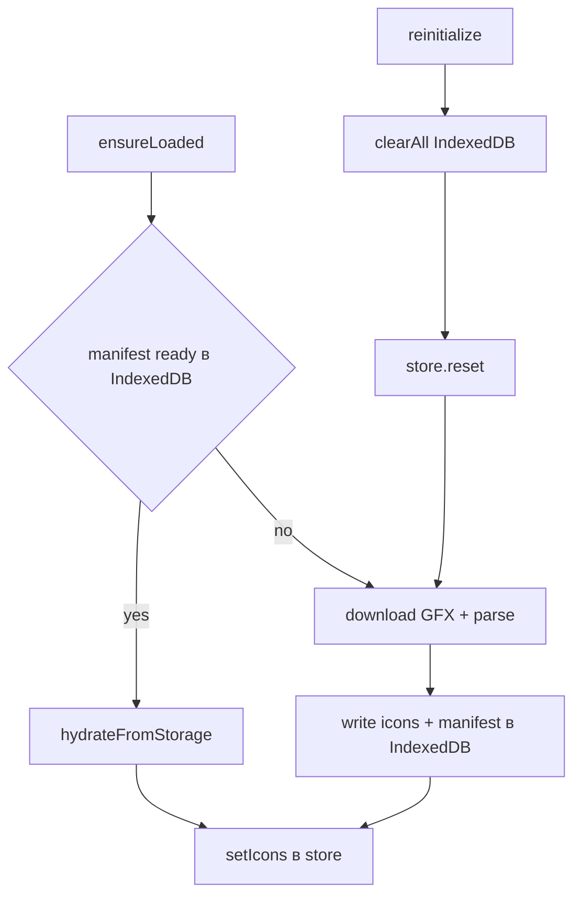

# GFX Icons feature

Кэширование и раздача SVG-иконок карты, извлечённых из игрового GFX-файла
(`hudmenu.gfx`).

## Назначение

Карта Skyrim отображает маркеры локаций. Иконки маркеров хранятся в Scaleform
GFX-файле на стороне сервера. Эта фича:

1. скачивает GFX-файл по WebSocket (`file_download`);
2. парсит все `DefineShape` и генерирует SVG для каждой фигуры;
3. кэширует результат в **IndexedDB**;
4. отдаёт `data:image/svg+xml` URL по `shapeId` через Pinia-store.

## Структура

```
src/features/gfx-icons/
├── config/
│   ├── gfxIcons.ts         # Константы: путь к файлу и конфигурация IndexedDB
│   └── typeIdToGfxId.ts    # Маппинг «тип точки карты → shapeId»
├── helpers/
│   ├── gfxDb.ts            # Низкоуровневый слой IndexedDB
│   ├── gfxStorage.ts       # Публичный API (re-export gfxDb)
│   └── useGfxIconsLoader.ts# Оркестрация загрузки и ре-инициализации
├── lib/
│   └── types.ts            # Типы манифеста и записей IndexedDB
└── index.ts                # Публичный экспорт фичи
```

## Хранение (IndexedDB)

- База данных: `gfx-icons` (версия 1).
- Object store `icons` — ключ `shapeId`, значение `{ shapeId, svg, updatedAt }`.
- Object store `manifest` — ключ `id: "main"`, значение
  `{ id, ready, shapeCount, shapeIds, generatedAt }`.

Манифест фиксирует факт успешной записи полного набора. При hydrate наличие
`ready === true` и всех перечисленных `shapeIds` считается валидным кэшем.

`localStorage` больше не используется — старый кэш после обновления просто
игнорируется, иконки скачиваются заново.

## Жизненный цикл загрузки



### Публичный API

| Функция | Назначение |
|---|---|
| `useGfxIconsLoader().ensureLoaded()` | Гарантировать доступность иконок (hydrate или скачивание) |
| `useGfxIconsLoader().reinitialize()` | Очистить кэш и перескачать весь набор |
| `readManifest()` | Прочитать манифест из IndexedDB |
| `writeManifest(manifest)` | Записать манифест |
| `readSvg(shapeId)` | Прочитать одну SVG |
| `writeSvg(shapeId, svg)` | Записать/обновить одну SVG |
| `clearAll()` | Удалить манифест и все иконки |

### Хранение в памяти

`useGfxIconsStore` (Pinia) держит карту `svgByShapeId: Record<number, string>` и
флаги `isReady` / `isLoading` / `error`. Получить data-URL по `shapeId` можно
через `resolveIconUrl(shapeId)`.

## Ручная ре-инициализация

Кнопка «Reload icons» в настройках вызывает `reinitialize()`:

1. ждёт завершения текущей загрузки (если идёт);
2. очищает IndexedDB (`clearAll`);
3. сбрасывает store (`reset`);
4. запускает `ensureLoaded()` заново.

Это покрывает сценарии: изменился GFX-файл, повреждён кэш, нужно принудительно
обновить иконки после добавления нового маппинга `type → shapeId`.

## Добавление новых иконок

Сопоставление «тип точки карты → shapeId» задаётся в
[`config/typeIdToGfxId.ts`](config/typeIdToGfxId.ts) через `GFX_SHAPE_ID_BY_TYPE`.

Порядок действий:

1. **Найти `shapeId` нужной иконки** — сгенерировать галерею по инструкции из
   [`scripts/gfx/README.md`](../../../scripts/gfx/README.md) (`names.mjs` +
   `gallery.mjs`) и визуально определить иконку; либо использовать
   `scripts/gfx/out/names.json` (mapping `shapeId` → имена).
2. **Добавить запись** в `GFX_SHAPE_ID_BY_TYPE`, указав `known` (обнаруженная
   локация, `canFastTravel: true`) и `undiscovered` (необнаруженная).
3. **Проверить в приложении** — если иконка не появилась, нажать
   «Reload icons» в настройках, чтобы пересоздать кэш IndexedDB.
4. **Задокументировать** соответствие нового типа точки иконкам (имена/`shapeId`)
   в комментарии рядом с записью, чтобы сохранить историю.
